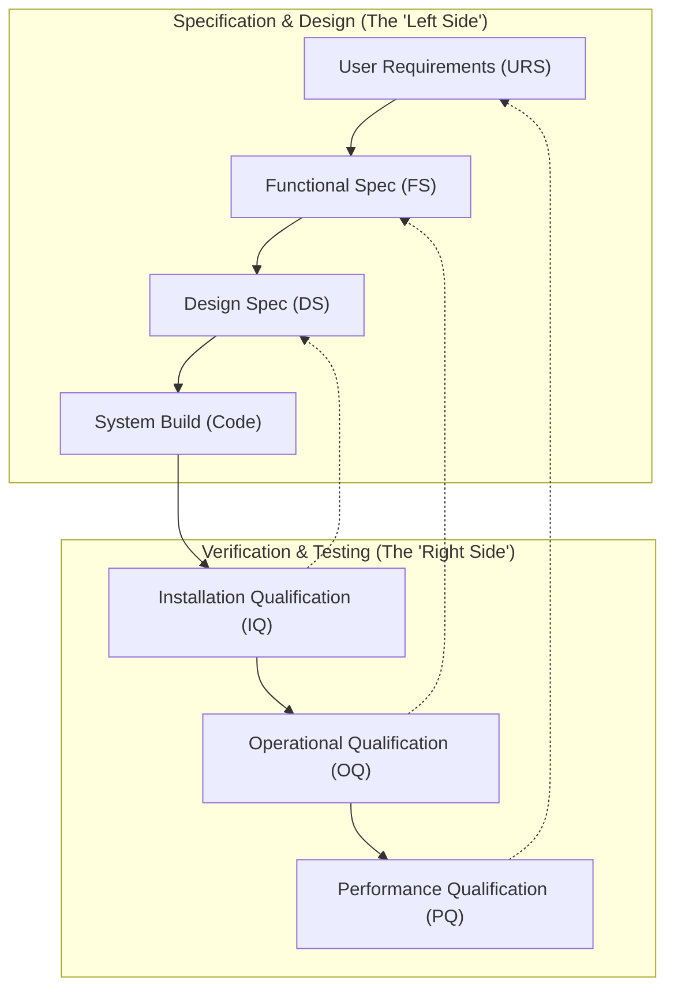

# GCP (ICH E6): The Exhaustive Guide for Software in Clinical Trials

## Table of Contents
1.  [Introduction: Why GCP Matters for Software](#introduction)
2.  [Core Terminology: The Language of Clinical Trials](#core-terminology)
3.  [The 13 Core Principles of ICH GCP: The Ethical & Scientific Foundation](#core-principles)
4.  [ALCOA++: The Golden Rules of Data Integrity](#alcoa)
5.  [The Audit Trail: The Unimpeachable Record of Truth](#audit-trail)
6.  [The Computerized System in Clinical Trials (Section 5.5.3)](#computerized-system)
7.  [Computer System Validation (CSV): The Proving Ground](#csv)
    *   [The V-Model of Validation](#v-model)
    *   [Key Validation Documents and Stages](#validation-documents)
8.  [Practical Software Design & Architectural Checklist for GCP Compliance](#checklist)
9.  [Roles & Responsibilities in the GCP Ecosystem](#roles)
10. [Conclusion: Building Systems of Trust and Evidence](#conclusion)

---

## 1. Introduction: Why GCP Matters for Software
<a name="introduction"></a>

While HIPAA focuses on patient data **privacy** and GDPR on personal data **rights**, Good Clinical Practice (GCP) is an international ethical and scientific quality standard for designing, conducting, recording, and reporting clinical trials that involve human subjects. The most widely adopted standard is the **ICH E6(R2)** guideline from the International Council for Harmonisation.

The primary goal of GCP is to ensure two things:
1.  The **rights, safety, and well-being** of trial subjects are protected.
2.  The clinical trial **data are credible, reliable, and accurate**.

For software developers and architects, GCP is not just a set of best practices; it's a regulatory mandate. If your software is used to collect, manage, analyze, or report data in a clinical trial that will be submitted to regulatory authorities like the FDA (USA) or EMA (Europe), that software becomes part of the trial's official record. **Its reliability is as critical as the drug or device being tested.**

Non-compliance can lead to catastrophic consequences: rejection of a multi-million dollar drug submission, regulatory sanctions, and a complete loss of trust. In the world of GCP, your software is not just a tool; it is an instrument of scientific measurement, and it must be provably accurate and reliable.

## 2. Core Terminology: The Language of Clinical Trials
<a name="core-terminology"></a>

*   **Clinical Trial**: A research study involving human subjects to evaluate the effects of a new drug, medical device, or other intervention.
*   **Sponsor**: The individual, company, institution, or organization that takes responsibility for the initiation, management, and/or financing of a clinical trial. (e.g., Pfizer, Johnson & Johnson).
*   **Investigator**: The individual responsible for the conduct of the clinical trial at a trial site (e.g., a doctor at a hospital).
*   **Protocol**: A document that describes the objective(s), design, methodology, statistical considerations, and organization of a trial. It is the single source of truth for how a trial must be conducted.
*   **eCRF (Electronic Case Report Form)**: A digital questionnaire used to collect trial data for each subject. Your software may be the platform that hosts these eCRFs.
*   **EDC (Electronic Data Capture)**: The software system used to collect clinical trial data in electronic format (e.g., the platform hosting the eCRFs). This is a common type of GCP-regulated software.
*   **eTMF (Electronic Trial Master File)**: A system to store and manage all essential documents of a clinical trial.
*   **CTMS (Clinical Trial Management System)**: Software that manages the operational aspects of a clinical trial (e.g., tracking subject visits, site payments).
*   **Computerized System**: Any system (including hardware, software, and network components) that creates, modifies, maintains, archives, retrieves, or transmits trial data. **This is your software.**
*   **Validation (CSV - Computer System Validation)**: The formal, documented process of demonstrating that a computerized system does exactly what it is designed to do in a consistent and reproducible manner.
*   **Audit Trail**: A secure, computer-generated, time-stamped electronic record that allows for the reconstruction of the course of events relating to the creation, modification, or deletion of an electronic record. **This is a non-negotiable, core feature.**
*   **Source Data**: All information in original records and certified copies of original records of clinical findings, observations, or other activities in a clinical trial. `eSource` refers to source data captured directly into an electronic medium.

## 3. The 13 Core Principles of ICH GCP: The Ethical & Scientific Foundation
<a name="core-principles"></a>

Your software must be designed to help Sponsors and Investigators adhere to these principles.

1.  **Ethical Conduct**: Trials must be ethical (conforming to the Declaration of Helsinki).
2.  **Benefits Justify Risks**: The foreseeable risks must be weighed against the anticipated benefits for the subject and society.
3.  **Subject Rights, Safety, and Well-being are Paramount**: These interests must always prevail over the interests of science and society.
4.  **Adequate Nonclinical/Clinical Information**: There must be sufficient prior information to support the proposed trial.
5.  **Scientifically Sound Protocol**: The trial must be described in a clear, detailed protocol.
6.  **Protocol Compliance**: The trial must be conducted in compliance with the protocol.
7.  **Qualified Physician Responsibility**: Medical decisions must be made by a qualified physician.
8.  **Qualified Personnel**: Each individual involved in conducting a trial should be qualified by education, training, and experience.
9.  **Informed Consent**: Freely given informed consent must be obtained from every subject prior to participation.
10. **Data Integrity (Recording, Handling, Storing)**: All clinical trial information should be recorded, handled, and stored in a way that allows its accurate reporting, interpretation, and verification. **(This is the primary software mandate).**
11. **Confidentiality**: The confidentiality of records that could identify subjects should be protected.
12. **Good Manufacturing Practice (GMP)**: Investigational products should be manufactured according to GMP.
13. **Quality Systems**: Systems with procedures that assure the quality of every aspect of the trial should be implemented.

## 4. ALCOA++: The Golden Rules of Data Integrity
<a name="alcoa"></a>

ALCOA (and its extension, ALCOA++) is a mnemonic used by regulatory bodies to define the characteristics of high-quality data. Your software **must** be designed to produce data that meets these criteria.

*   **A - Attributable**: It must be possible to identify the individual or system that performed an action.
    *   **Software Implementation**:
        *   **Unique User IDs**: Mandatory. No shared or generic accounts.
        *   **Secure Authentication**: Strong passwords, MFA.
        *   **Audit Trails**: Every data point and change must be linked to a specific user and a timestamp. `Created by user_x on YYYY-MM-DD HH:MM:SS`.

*   **L - Legible**: The data must be readable and understandable throughout its entire lifecycle.
    *   **Software Implementation**:
        *   Data must be stored in a non-corruptible format.
        *   The UI must present data clearly. Avoid cryptic codes; use controlled vocabularies and human-readable labels.
        *   Long-term archival strategy must ensure data can still be read years later.

*   **C - Contemporaneous**: The data must be recorded at the time it was generated or observed.
    *   **Software Implementation**:
        *   **Server-Side Timestamps**: Use the server's clock for all timestamps to prevent users from manipulating local clocks.
        *   **Prevent Back-Dating**: The system should not allow a user to enter a past date/time for a record's creation timestamp.
        *   Real-time data capture where possible.

*   **O - Original**: The record must be the first place the data was recorded (or a certified copy).
    *   **Software Implementation**:
        *   The system must be able to distinguish between `eSource` data (captured directly into the device) and data that was transcribed from another source (e.g., paper).
        *   The audit trail should reflect the data's origin.

*   **A - Accurate**: The data must be correct, truthful, and reflect what actually happened.
    *   **Software Implementation**:
        *   **Edit Checks / Input Validation**: This is critical. Implement range checks (e.g., `heart rate must be between 30 and 250`), type checks, and checks against other data points (e.g., `date of death cannot be before date of birth`).
        *   **Controlled Vocabularies**: Use dropdowns, radio buttons, or type-aheads linked to pre-approved lists to prevent free-text errors.

*   **The "++" Extensions**:
    *   **Complete**: All data from a record must be present, including any repeat or re-analysis performed. Nothing is deleted.
    *   **Consistent**: Data must be recorded in a consistent format and sequence (e.g., using a consistent date format `YYYY-MM-DD` everywhere).
    *   **Enduring**: Data must be maintained and accessible for the entire period it is needed (which can be decades). This has implications for your data archival and migration strategies.
    *   **Available**: The data must be accessible for review, audit, and inspection upon request.

## 5. The Audit Trail: The Unimpeachable Record of Truth
<a name="audit-trail"></a>

The GCP audit trail is the single most important technical feature for data integrity.

**What a GCP Audit Trail IS NOT:**
*   A simple log file on a server's filesystem.
*   A database table that an administrator can modify.
*   A record that can be turned off.

**What a GCP Audit Trail IS:**
*   **Secure & Immutable**: It must be stored in a way that it cannot be altered or deleted, even by system administrators. This often means using cryptographic techniques or write-only database permissions for the application user.
*   **Computer-Generated & Automatic**: It must be generated by the system, not the user, and it cannot be disabled.
*   **Time-Stamped**: Using a secure, synchronized time source.
*   **Comprehensive**: It must capture the **creation, modification, and deletion** of all GxP-relevant data. (Note: In GCP, data is rarely truly deleted; it's typically marked as obsolete, but the record and its audit trail remain).
*   **Contextual**: It must answer **Who, What, When, and Why**.
    *   **Who**: The unique User ID.
    *   **What**: The old value and the new value of the data point.
    *   **When**: The secure timestamp.
    *   **Why**: **This is a key GCP requirement.** If a user changes a data point, the system **must** require them to provide a reason for the change (e.g., "Data Entry Error," "Subject Correction"). This reason is stored as part of the audit trail record.

**Architectural Implementation:**
*   An `audit_trail` table is a common pattern.
    ```sql
    CREATE TABLE audit_trail (
        audit_id BIGSERIAL PRIMARY KEY,
        timestamp_utc TIMESTAMP WITH TIME ZONE NOT NULL,
        user_id INT NOT NULL REFERENCES users(user_id),
        table_name VARCHAR(255) NOT NULL,
        record_id VARCHAR(255) NOT NULL,
        field_name VARCHAR(255) NOT NULL,
        old_value TEXT,
        new_value TEXT,
        reason_for_change TEXT -- Cannot be null for updates
    );
    ```
*   This table should be populated via database triggers or application-level logic that cannot be bypassed.

## 6. The Computerized System in Clinical Trials (Section 5.5.3)
<a name="computerized-system"></a>

ICH E6(R2) Section 5.5.3 explicitly states the requirements for computerized systems.

When using electronic trial data handling/remote systems, the Sponsor must:
*   **(a) Ensure and document that the system is validated.** (See [CSV](#csv) section).
*   **(b) Maintain Standard Operating Procedures (SOPs)** for the use of these systems.
*   **(c) Ensure the systems are designed to permit data changes in such a way that the changes are documented and do not obscure the original data.** (This mandates an `ALCOA`-compliant [audit trail](#audit-trail)).
*   **(d) Have a security system that prevents unauthorized access.** (This mandates robust access controls).
*   **(e) Maintain a list of individuals who are authorized to make data changes.** (This mandates RBAC - Role-Based Access Control).
*   **(f) Maintain adequate backup of data.**
*   **(g) Safeguard the blinding**, if applicable (i.e., prevent users from seeing data that could reveal whether a subject is on the active drug or a placebo).

These points are a direct checklist for your software's core feature set.

## 7. Computer System Validation (CSV): The Proving Ground
<a name="csv"></a>

You cannot simply build software and hand it over. You must **prove** that it works as specified through a formal process called Computer System Validation (CSV). The mantra is: **"If it isn't documented, it didn't happen."**

### The V-Model of Validation
<a name="v-model"></a>
The V-Model is a common framework for illustrating the CSV process. The left side represents specification and design, and the right side represents testing and verification. Each level on the right tests the corresponding level on the left.
Specification & Design Verification & Testing



### Key Validation Documents and Stages
<a name="validation-documents"></a>

Your SDLC must produce these (or equivalent) documents.

1.  **User Requirements Specification (URS)**: What the user needs the system to do. Written in plain language.
    *   *Example: "The system must allow a clinical researcher to enter a subject's vital signs."*

2.  **Functional Specification (FS)**: How the system will meet the URS. Translates user needs into system functions.
    *   *Example: "The system will have a 'Vitals' eCRF with fields for Heart Rate, Blood Pressure (Systolic/Diastolic), and Temperature. The Heart Rate field will only accept integers between 30 and 250."*

3.  **Design Specification (DS)**: The detailed technical design to fulfill the FS. This is for the developers.
    *   *Example: "The `vitals` table will have an `hr_value` column of type `INTEGER`. The application will have a server-side validation check: `if (hr_value < 30 || hr_value > 250) return error`."*

4.  **Installation Qualification (IQ)**: A documented test protocol that proves you can correctly install the software and its prerequisites in the target environment.
    *   *Test Script Example: "Verify server OS is Ubuntu 20.04. Verify PostgreSQL v12.5 is installed. Verify application code deploys successfully."*

5.  **Operational Qualification (OQ)**: Testing that the system functions according to the Functional Specification in a controlled environment.
    *   *Test Script Example: "Log in as a researcher. Navigate to the 'Vitals' form. Enter '29' in the Heart Rate field. Verify the system displays an error message 'Heart Rate must be between 30 and 250'."*

6.  **Performance Qualification (PQ)**: Testing that the system works as intended in the *actual* user environment with real-world processes. This is often performed by the end-users.
    *   *Test Script Example: "User Jane Doe, following SOP 123, successfully enters the vital signs for subject #001 during their scheduled visit."*

## 8. Practical Software Design & Architectural Checklist for GCP Compliance
<a name="checklist"></a>

*   **[ ] Access Control**:
    *   Does every user have a unique login?
    *   Is there a strong password policy and MFA?
    *   Is Role-Based Access Control (RBAC) implemented to enforce least privilege?
    *   Is there a documented process for granting/revoking access?

*   **[ ] Data Integrity (ALCOA++)**:
    *   Is every piece of data attributable to a user and timestamp?
    *   Are edit checks and input validation implemented for all data entry points?
    *   Are controlled vocabularies used where possible?
    *   Does the system prevent back-dating or un-audited changes?

*   **[ ] Audit Trail**:
    *   Is there a non-editable, always-on audit trail for all data?
    *   Does it capture old/new values and a user-supplied reason for change?
    *   Is the audit trail easily reviewable by authorized personnel (e.g., monitors, auditors)?

*   **[ ] System Operations**:
    *   Is there a reliable, tested backup and restore process?
    *   Are systems and data secured against unauthorized external access (firewalls, etc.)?
    *   Is data encrypted in transit and at rest?
    *   Is there a disaster recovery plan?

*   **[ ] Validation & SDLC**:
    *   Is the system developed under a formal SDLC with change control?
    *   Is there a complete validation package (URS, FS, IQ, OQ, PQ) for the system?
    *   Is every change to the system managed through a documented change control process, including an assessment of its impact on the validated state?

## 9. Roles & Responsibilities in the GCP Ecosystem
<a name="roles"></a>

*   **Sponsor**: Ultimately responsible for the trial and for ensuring any computerized systems they use are validated and fit for purpose. They are your primary customer.
*   **Investigator/Site Staff**: The end-users of your software, entering data at the clinical site.
*   **Monitors (e.g., CRAs)**: Appointed by the Sponsor to oversee the trial. They will use your software to review data for accuracy and completeness, including reviewing audit trails.
*   **Auditors/Inspectors**: From the Sponsor's Quality Assurance department or a regulatory agency (like the FDA). They will inspect your system, its validation documentation, and its data to ensure compliance. Your software must be designed to make their job possible.

## 10. Conclusion: Building Systems of Trust and Evidence
<a name="conclusion"></a>

Building software for a GCP environment is fundamentally different from typical application development. The focus shifts from speed and features to **reliability, integrity, and provability**.

Your software is not just a product; it is a critical piece of **evidence**. The validation documentation is evidence that your system is built correctly. The audit trail is evidence of how data was created and managed. The data itself is evidence of a drug's safety and efficacy.

GCP compliance requires a disciplined engineering culture that embraces documentation, rigorous testing, and formal change control. The result is software that is not just functional, but trustworthy—a quality that is indispensable when the health and safety of millions of future patients are on the line.